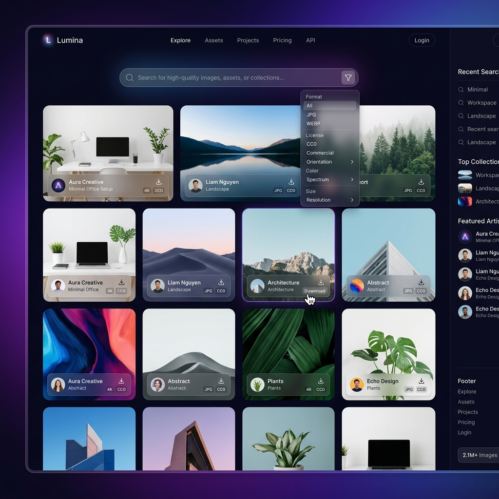
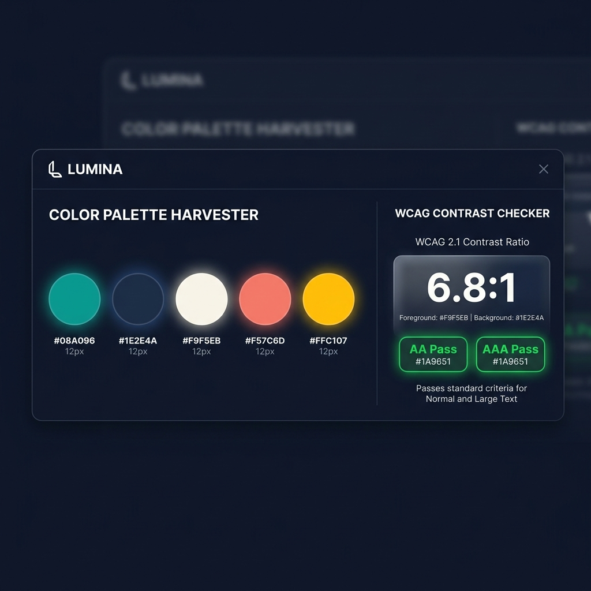

# Lumina // Developer's Smart Image Workspace & Live Asset Studio

Lumina is a premium, client-side developer utility that bridges the gap between stock photography search and active front-end asset pipelines. It elevates standard stock search engines into an interactive design-to-development workspace.



---

## 💎 Core Features

### 1. Intelligent Search & Composition Filters
* Search over 3 million stock photos powered by the Unsplash API.
* Dynamic client-side filters for **Orientation**, **Dominant Hue**, and **Composition** (e.g., *Rule-of-Thirds Copyspace* for copy overlays and *Minimalist Backdrop* selections).
* Fully automated offline fallback dataset: If API limits are exceeded or internet drops, Lumina seamlessly shifts to its high-resolution template catalog.

### 2. Canvas-Based Palette Harvester
* When you select an image, Lumina loads the bitmap on a hidden background canvas and executes an optimized **k-means approximation algorithm** to extract 5 diverse, harmonious color swatches.
* View and copy HEX codes, RGB, and HSL custom property variables with one click.



### 3. WCAG 2.1 Accessibility Evaluator
* Test text overlay contrast in real-time.
* Uses W3C relative luminance formulas: $L = 0.2126R + 0.7152G + 0.0722B$ (where components are linear sRGB).
* Displays live contrast ratios and provides accessibility pass/fail verdicts (AA/AAA ratings) for both normal (16px) and large (>18px bold) typography.

### 4. Brand-Harmonizer Duotone Filters
* Dynamically map image highlights and shadows to your brand colors using hardware-accelerated **SVG color matrix filters**.
* Enter custom primary and secondary brand HEX colors and adjust the values live on the canvas workspace.

### 5. Web Asset Code Generator
* Instantly write optimized responsive frontend layout code in three formats:
  - **HTML + Srcset**: Responsive image tags with aspect-ratio containers.
  - **React 19 Functional Component**: Standard JSX image tag wrapper ready for modern frameworks.
  - **CSS Responsive Layout**: Progressive loading custom variables.
* **Inline SVG Blur Placeholders**: Each generated block contains an automatically generated base64-encoded micro SVG gradient created from the image's dominant colors. This provides a gorgeous blur-load preview without blocking page render.

### 6. Live Social Banner Studio
* Adjust backdrop blur, vignette overlays (contrast protection), and text shadow overlays to ensure typography readability.
* Align text using a responsive 9-cell **Rule of Thirds grid layout**.
* Export the resulting configuration as a high-quality **PNG banner** for social sharing or headers.

---

## 🛠️ Technology Stack
Lumina is designed to run entirely on the client, maximizing load speeds and performance with zero compiler/bundler overhead:
* **Core**: Semantic HTML5.
* **Styling**: Modern Vanilla CSS utilizing CSS Custom Properties, flexbox, grid, glassmorphism card templates, and fluid micro-animations.
* **Logic**: Modern ES6+ JavaScript (k-means color extraction, WCAG luminance ratios, canvas drawing engines, and SVG filter parameters).

---

## 🚀 Getting Started

Lumina runs completely self-contained in the browser.

### Local Development
You can run Lumina by simply double-clicking the `index.html` file, or spinning up a simple static files server:

**Using Node.js:**
```bash
npx serve .
```

**Using Python:**
```bash
python -m http.server 8000
```
Open `http://localhost:8000` (or the served port) in your web browser.

---

## 📄 License
This project is open-source and available under the [MIT License](LICENSE).

